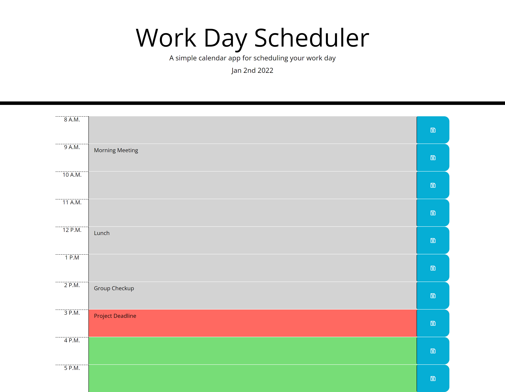

# Work Day Scheduler
This applications purpose is to help individuals working a 9-5 job keep track of their daily tasks.

## Technologies
`HTML/CSS` 
`Javascript` 
`Moment.js` 
`jQuery` 

## Install
To install this application simply clone this repository, open it in your code editor and open the `index.html` in your browser.

## Usage 
This application allows users to save tasks to an hourly time slot. Depending on the hour the time slot's color will change indicating that the task is currently due, upcoming in the near future, or it has already passed.  

## Live Application 
[Here](https://spurgason.github.io/work-day-scheduler/)

## Contributor
[Shane Purgason](https://github.com/spurgason)

## Questions
[Github](https://github.com/spurgason)  
[Email](mailto:shanepurgason.98@gmail.com)